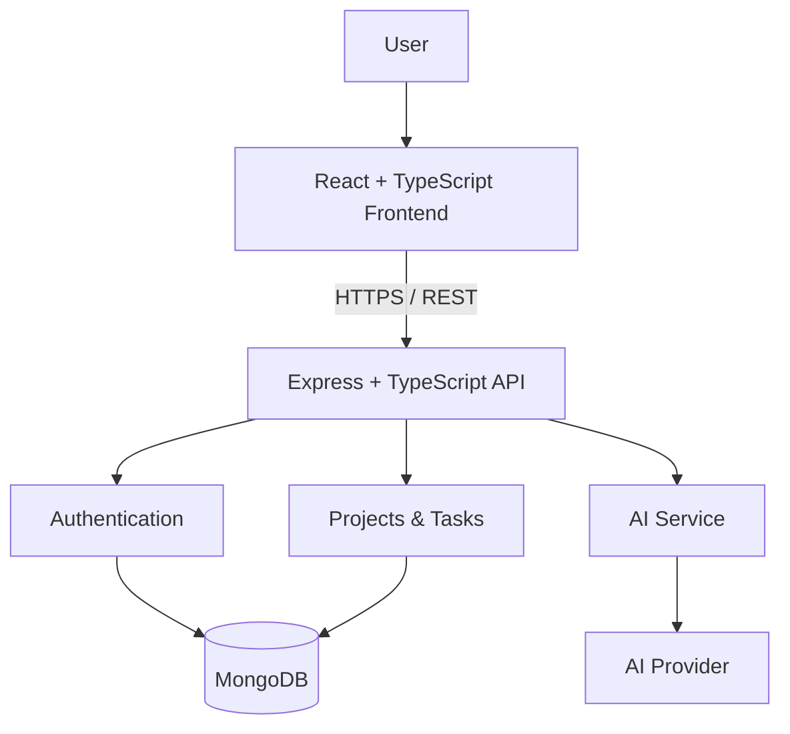

# DevMind AI — System Architecture

```mermaid
flowchart TD
    USER["User"]
    CLIENT["React + TypeScript Frontend"]
    API["Express + TypeScript API"]
    AUTH["Authentication"]
    PROJECT["Projects & Tasks"]
    AI["AI Service"]
    DB[("MongoDB")]
    AI_PROVIDER["AI Provider"]

    USER --> CLIENT
    CLIENT -->|"HTTPS / REST"| API

    API --> AUTH
    API --> PROJECT
    API --> AI

    AUTH --> DB
    PROJECT --> DB
    AI --> AI_PROVIDER
```